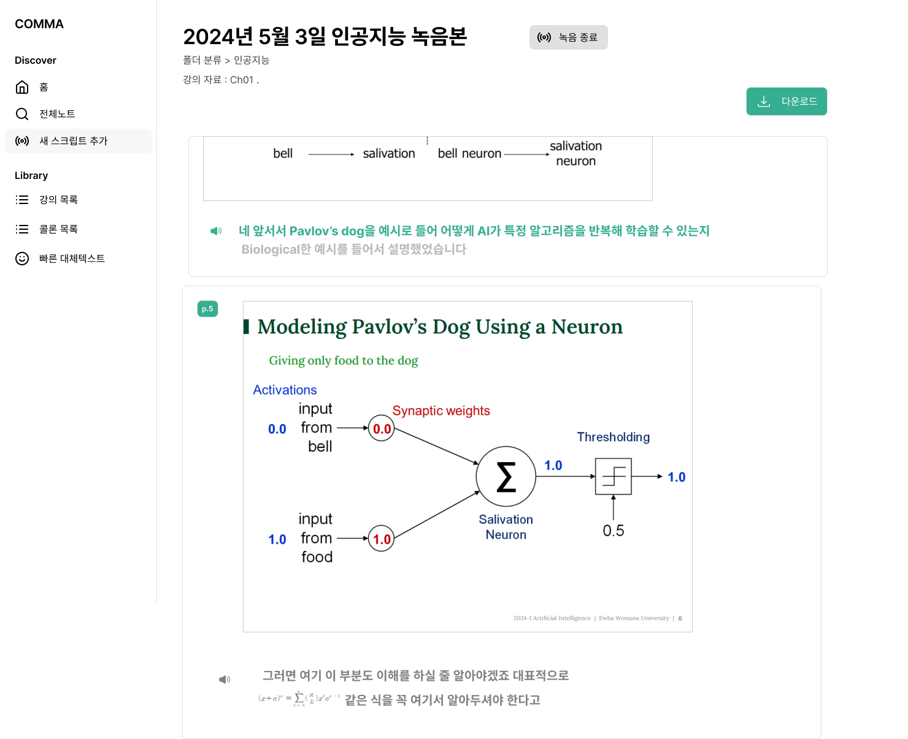
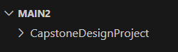
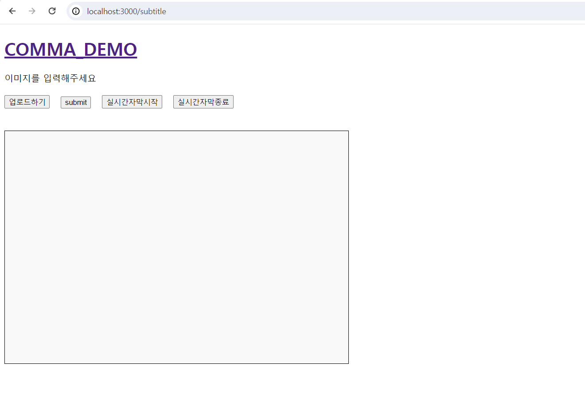

# 시·청각 장애 학습자 보조 프로그램 COMMA

AI 기반 학습자 맞춤형 **실시간 자막/대체텍스트** 및 **대체학습자료** 생성 프로그램

<!--Project Title Image-->
|
---|---|

<!--Project Buttons-->
[![Readme in English][readme-en-shield]][readme-en-url] [![View Demo Video][view-demo-shield]][view-demo-url]
&nbsp;

&nbsp;


<!--Table of Contents-->
# 목차
- [[1] 프로젝트 소개](#1-프로젝트-소개)
  - [주기능](#주기능)
  - [기술](#기술)
- [[2] 시작하기](#2-시작하기)
  - [시작하기 전 요구사항](#시작하기-전-요구사항)
  - [설치](#설치)
  - [설정](#설정)
- [[3] 실행하기 - DEMO 버전](#3-실행하기)
  - [실행](#실행)
  - [오류](#오류)
- [[4] License](#4-license)
&nbsp;

&nbsp;


# [1] 프로젝트 소개
***COMMA : Comment Assistant***   
*열악한 환경에서 공부해 온 시·청각 장애 학습자들에게 기술적 도움을 제공하여 **쉼표**가 되고자 합니다*   

-----

현재 시·청각 장애인의 학습 현장에는 다음과 같은 문제가 존재합니다:
1) 장애인 학습자 보조 기술의 질이 현저히 낮거나 부재
2) 시·청각 장애인은 제한적인 감각을 사용하여 공부하므로 근본적인 제약을 가짐   


COMMA는 이러한 문제 상황에 대해 다음의 기능으로 해답을 제시합니다:
1) **AI 기반 실시간 자막 및 대체 텍스트** 생성 기능
2) 학습자 맞춤 **대체학습자료 콜론(:)** 제작 기능   
&nbsp;


## 주기능
***1. AI 기반 강의 보조 기능 - 실시간 자막 및 대체텍스트***   

(1) 청각장애 학습자 
- 교수자의 언어를 실시간으로 표기해 주는 실시간 자막 서비스 이용 가능
- Google Speech-to-Text API와 모델 적응 키워드 부스팅 기능을 이용하여 자막의 정확도를 높임

|
---|---|   

(2) 시각장애 학습자
- 강의자료를 사전에 업로드하여 대체텍스트를 제공받을 수 있음   
   
|
---|---|   

&nbsp;


***2. 학습자 맞춤형 대체학습자료 콜론(:) 제작***
- 시·청각 장애인의 강의 자료에 대한 접근성을 개선하기 위해 이들이 활용하기 어려운 강의 자료를 각 장애 학습자의 특성에 맞추어 생성한 대체학습자료
- 시·청각 장애 학습자들이 실시간 강의 후에도 자립적·효율적으로 공부할 수 있도록 이들의 학습을 보조할 수 있음   

|
---|---|

&nbsp;


## 기술
- [React](https://react.dev/) 18.3.1
- [Node](https://nodejs.org/en) 20.11.1
- [Google-Speech-to-text-API](https://cloud.google.com/)
- [GPT-4o-API](https://openai.com/index/openai-api/)
&nbsp;

&nbsp;


# [2] 시작하기 - DEMO 버전
*본 튜토리얼은 Window OS 환경 기반으로 설명합니다*
## 시작하기 전 요구사항
- [Node 설치](https://nodejs.org/en/download/package-manager)
- [OPENAI API](https://platform.openai.com/) : GPT-4o API 사용하기 위해 키 발급 받기
    - [참고 블로그](https://velog.io/@ji1kang/OpenAI%EC%9D%98-API-Key-%EB%B0%9C%EA%B8%89-%EB%B0%9B%EA%B3%A0-%ED%85%8C%EC%8A%A4%ED%8A%B8-%ED%95%98%EA%B8%B0) : API 키 따로 저장해두기
- [Goole Cloud Speech API](https://console.cloud.google.com/apis/dashboard) : Cloud Speech API 키를 발급 받기
    - [참고 블로그](https://webnautes.tistory.com/2046) : API 키를 JSON 유형으로 저장

## 설치
1. Clone the repository
```bash
git init

git clone https://github.com/WarmElephantMario/CapstoneDesignProject.git
```

&nbsp;


2. 
```bash
cd CapstoneDesignProject
```

## 설정
*API 키를 설정합니다*   
&nbsp;

**1. OPENAI API 키 설정**
- backend 폴더에 .env 파일 추가   


- .env 파일에 OPENAI API 키 설정

```bash
#.env
OPENAI_API_KEY = YOUR_API_KEY
```
&nbsp;

**2. Google API 키 설정**   
- CapstoneDesignProject 폴더에 Google key json 파일 추가   
*예: warmelephantmario.json*
&nbsp;

   

- backend/server.js 에 Google key json 설정
```javascript
#backend/server.js

process.env.GOOGLE_APPLICATION_CREDENTIALS = "YOUR_KEY_FILE.json";
```

&nbsp;

&nbsp;


# [3] 실행하기 - DEMO 버전
## 실행
**1. 데모버전 웹사이트 실행**
```bash
# CapstoneDesignProject
yarn
```
```bash
yarn run dev
```

**2. 데모버전 메인 화면**   


**3. 데모버전 대체텍스트 화면**   


**4. 데모버전 실시간 자막 화면**   


&nbsp;

## 오류
*실행 시 발생할 수 있는 오류들에 대한 해결 방법입니다*   

**1. react-dom 오류**   
```bash
# npm 설치가 안되어있다면 설치 후 실행
npm install react-dom
```   

**2. eslint-config-react-app 오류**
```bash
npm install --save-dev eslint-config-react-app
```

**3. react-router-dom / web-vitals / react-app / webpack 오류**
```bash
npm install react-router-dom web-vitals react-app
```

&nbsp;


# [4] license
이 프로젝트는 MIT 라이선스가 부여됩니다. 자세한 내용은 [`LICENSE`][license-url] 파일을 참조하십시오.


<!--Url for Buttons-->
[readme-en-shield]: https://img.shields.io/badge/Readme%20in%20English-lightgreen?style=for-the-badge
[view-demo-shield]: https://img.shields.io/badge/View%20Demo%20video-darkgreen?style=for-the-badge
<!-- 수정 필요 -->
[view-demo-url]: https://github.com/WarmElephantMario/CapstoneDesignProject


<!--URLS-->
[license-url]: readme/LICENSE.md
[readme-en-url]: README_EN.md

