# COMMA : Assistive Program for Learners with Visual and Hearing Impairments

AI-based personalized **real-time captioning/alternative text** and **alternative learning materials** generation program

<!--Project Title Image-->
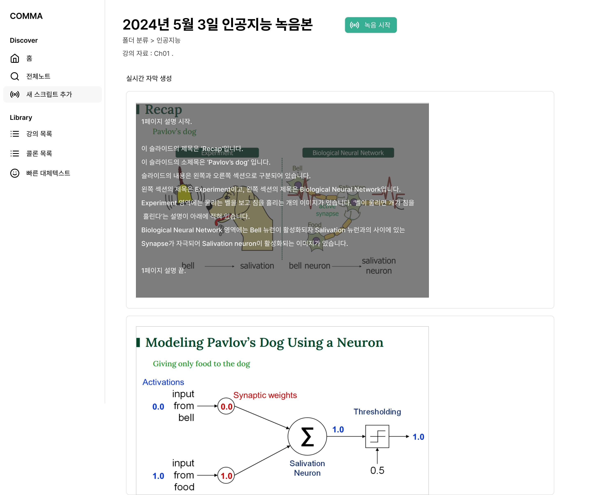|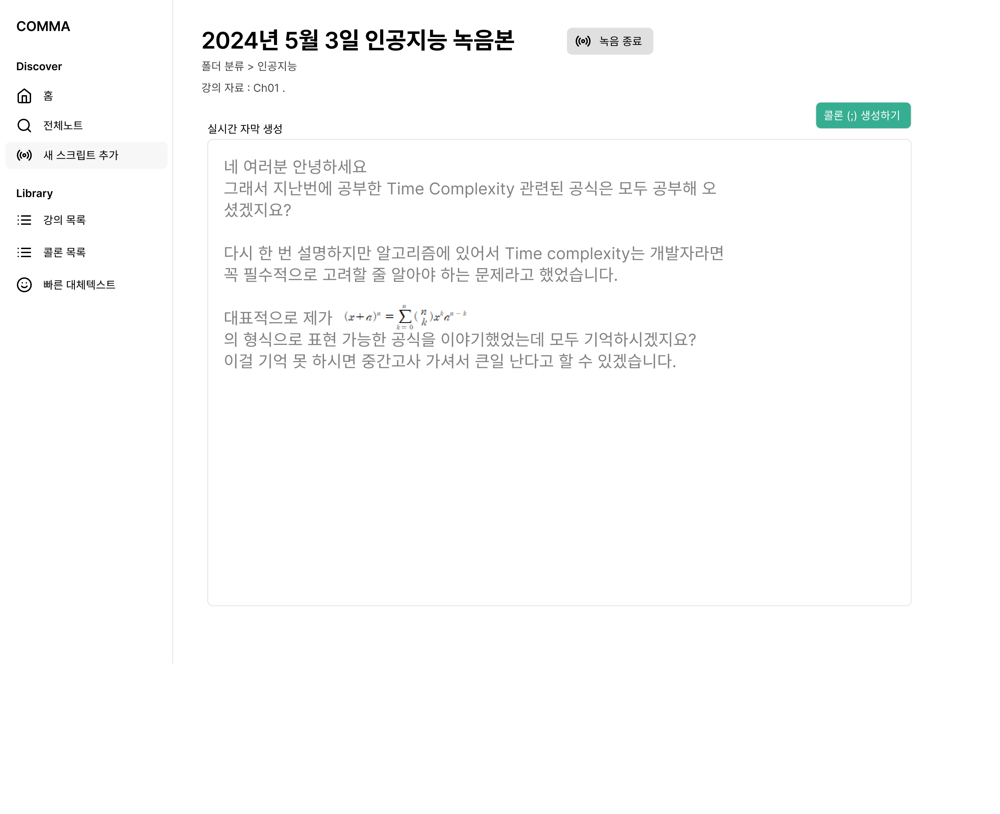
---|---|

<!--Project Buttons-->
[![Readme in Korean][readme-ko-shield]][readme-ko-url] [![View Demo Video][view-demo-shield]][view-demo-url]

<!--Table of Contents-->
# Table of Contents
- [[1] About the Project](#1-about-the-project)
  - [main functions](#main-functions)
  - [Technologies](#technologies)
- [[2] Getting Started](#2-getting-started)
  - [Prerequisites](#prerequisites)
  - [Installation](#installation)
  - [Configuration](#configuration)
- [[3] Running - DEMO Version](#3-Running)
  - [Execution](#Execution)
  - [Errors](#errors)
- [[4] License](#4-licensen)


# [1] About the Project
***COMMA: Comment Assistant***   
COMMA aims to provide technical assistance to visually and hearing impaired learners who have been studying in adverse environments, aiming to serve as a respite for them.

-----

The current learning environment for visually and hearing impaired individuals faces the following challenges: 
1) The quality of assistive technology for disabled learners is significantly low or absent.
2) Visually and hearing impaired individuals face fundamental constraints as they study using limited senses.

COMMA addresses these issues with the following features:
1) **AI-based real-time captioning and alternative text** generation.
2) Customized **alternative learning materials, COLON(:)** creation.

## main functions
***1. AI-based Lecture Assistance Feature - Real-time Captioning and Alternative Text***   

(1) For Hearing Impaired Learners
- Real-time captioning service is available to display the language of the instructor in real-time.
- Utilizing Google Speech-to-Text API and model adaptation with keyword boosting functionality to enhance the accuracy of the captions.

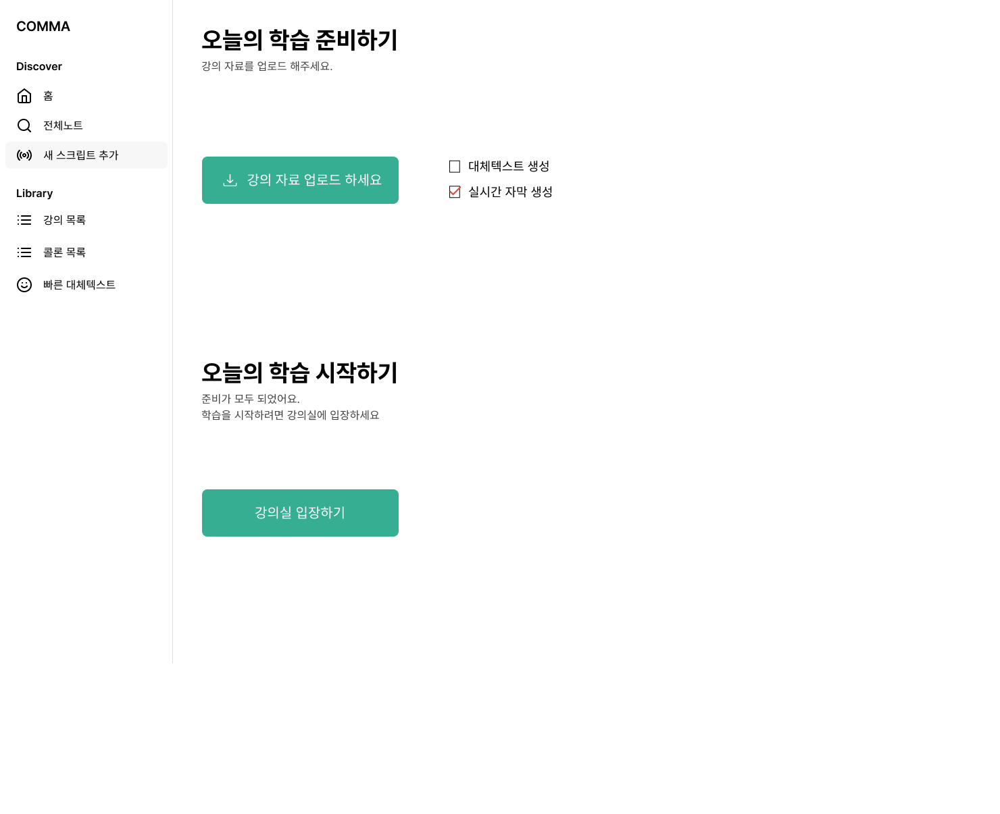|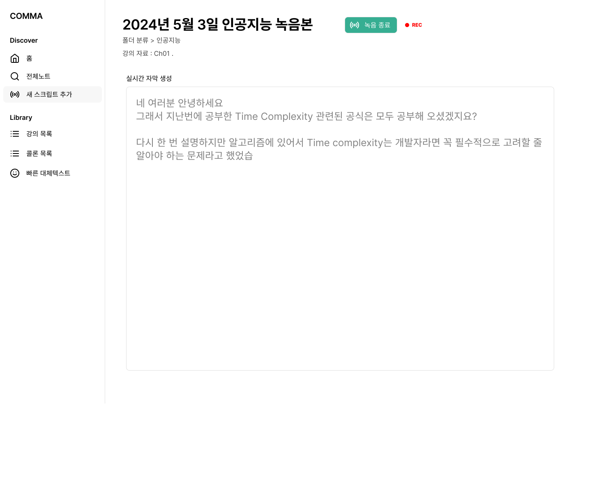
---|---| 

(2) For visually impaired learners
- Lecture materials can be uploaded in advance to receive alternative text.

|
---|---|  

&nbsp;


***2. Customized Alternative Learning Materials, COLON(:) Creation***
- To improve accessibility to lecture materials for visually and hearing impaired individuals, alternative learning materials tailored to the characteristics of each disabled learner are created for materials that are difficult for them to utilize.
- These alternative learning materials can assist visually and hearing impaired learners in studying independently and efficiently even after real-time lectures.

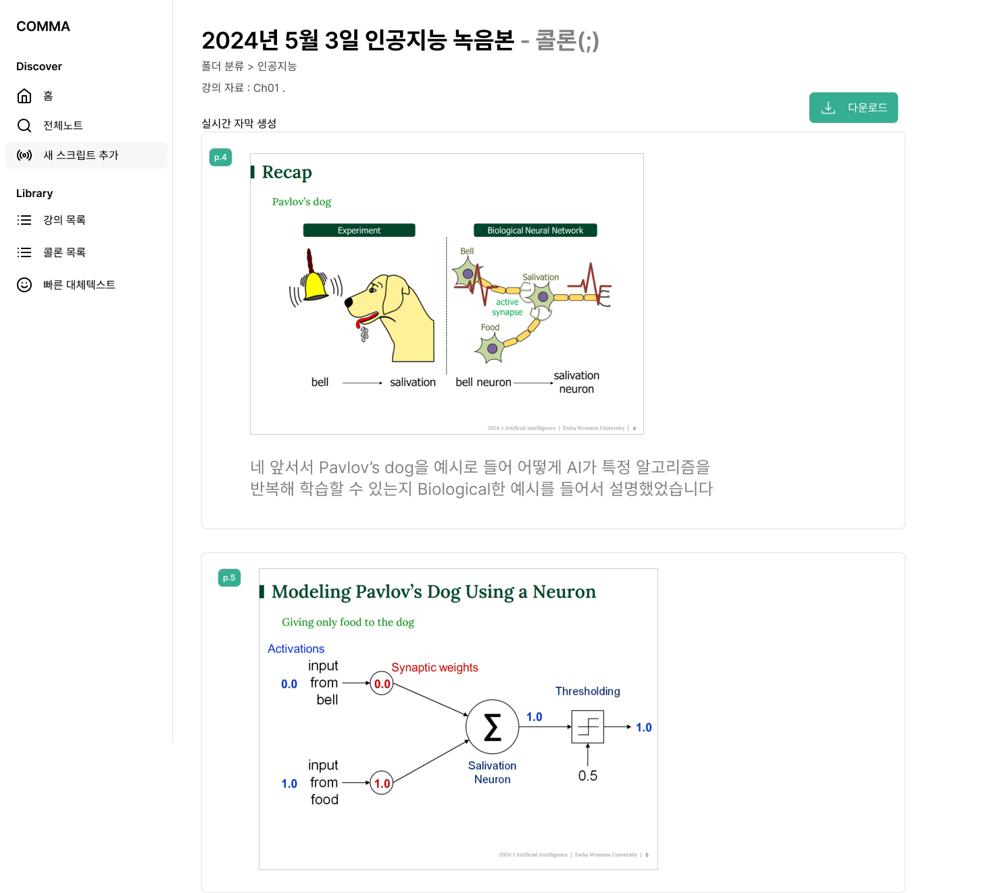|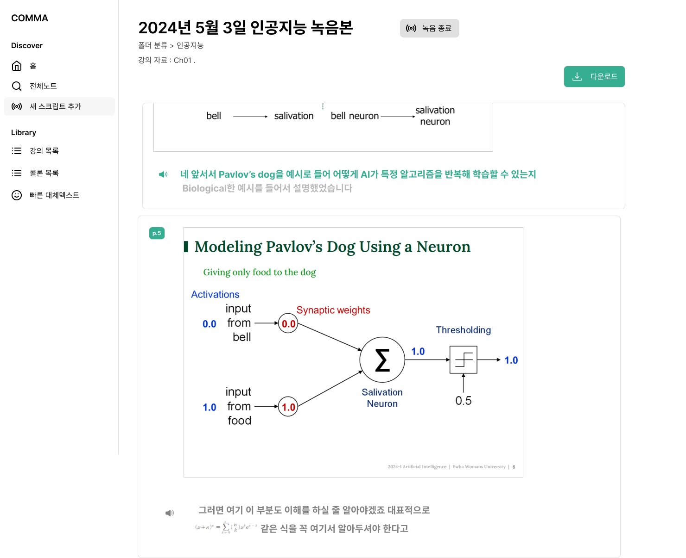
---|---|   

&nbsp;


## Technologies
- [React](https://react.dev/) 18.3.1
- [Node](https://nodejs.org/en) 20.11.1
- [Google-Speech-to-text-API](https://cloud.google.com/)
- [GPT-4o-API](https://openai.com/index/openai-api/)
&nbsp;

&nbsp;


# [2] Getting Started - DEMO version
*This tutorial is based on the Windows OS environment*
## Prerequisites
- [Node Installation](https://nodejs.org/en/download/package-manager)
- [OPENAI API](https://platform.openai.com/) : Obtain a key to use the GPT-4o API
    - [Reference Blog](https://velog.io/@ji1kang/OpenAI%EC%9D%98-API-Key-%EB%B0%9C%EA%B8%89-%EB%B0%9B%EA%B3%A0-%ED%85%8C%EC%8A%A4%ED%8A%B8-%ED%95%98%EA%B8%B0) : Store the API key separately
- [Goole Cloud Speech API](https://console.cloud.google.com/apis/dashboard) : Get a Cloud Speech API key
    - [Reference Blog](https://webnautes.tistory.com/2046) : Save the API key in JSON format

## Installation
1. Clone the repository
```bash
git init

git clone https://github.com/WarmElephantMario/CapstoneDesignProject.git
```
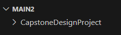
&nbsp;


2. 
```bash
cd CapstoneDesignProject
```

## Configuration
*Setting up API keys*   
&nbsp;

**1. Setting up OPENAI API key**
- Add a .env file in the backend folder   

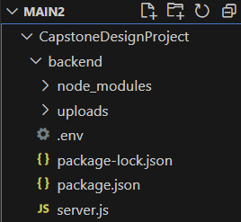


- Configure the OPENAI API key in the .env file

```bash
#.env
OPENAI_API_KEY = YOUR_API_KEY
```
&nbsp;

**2. Setting up Google API key**   
- Add the Google key JSON file to the CapstoneDesignProject folder
*Example: warmelephantmario.json*
&nbsp;

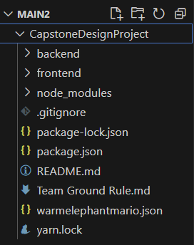   

- Configure the Google key JSON in backend/server.js
```javascript
#backend/server.js

process.env.GOOGLE_APPLICATION_CREDENTIALS = "YOUR_KEY_FILE.json";
```

&nbsp;

&nbsp;


# [3] Running - DEMO Version

## Execution
**1. Run the demo version website**
```bash
# CapstoneDesignProject
yarn
```
```bash
yarn run dev
```

**2. Demo version main screen** 
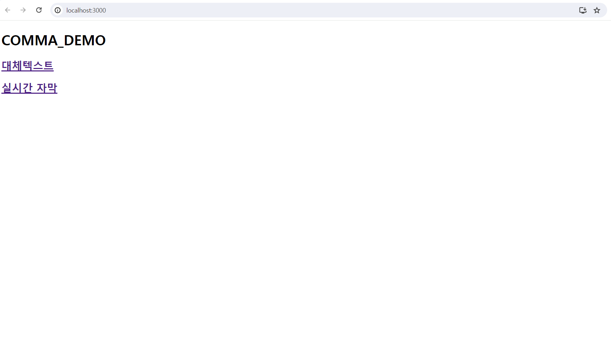

**3. Demo version alternative text screen**
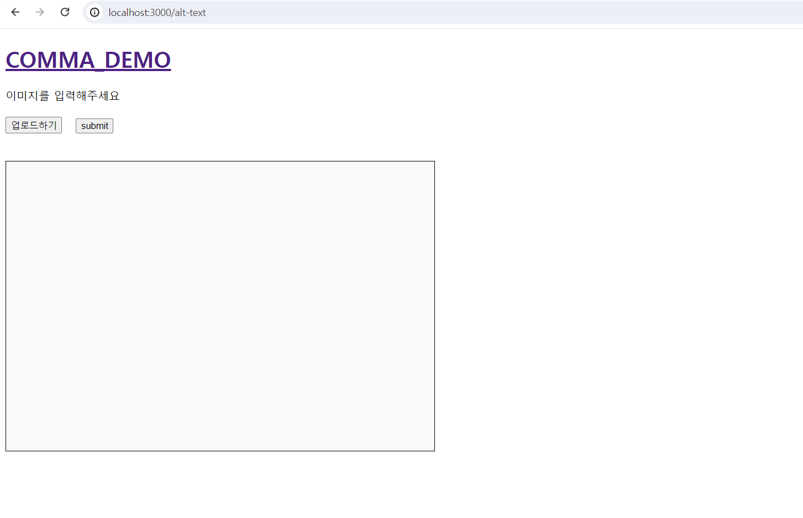

**4. Demo version real-time captioning screen**   
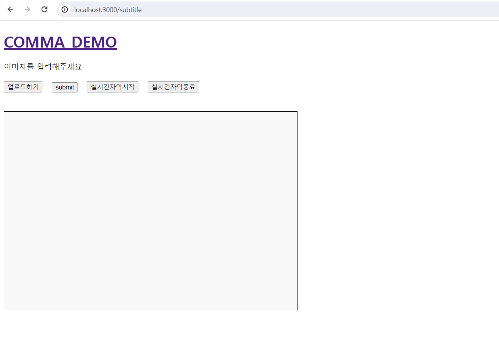

&nbsp;


## Errors
*Here are the solutions for possible errors that may occur during execution*   

**1. react-dom error**   
```bash
# If not installed, install and then run
npm install react-dom
```   

**2. eslint-config-react-app error**
```bash
npm install --save-dev eslint-config-react-app
```

**3. react-router-dom / web-vitals / react-app / webpack error**
```bash
npm install react-router-dom web-vitals react-app
```

&nbsp;


# [4] License
This project is licensed under the MIT License. See the [`LICENSE`][license-url] for more information.


<!--Url for Buttons-->
[readme-ko-shield]: https://img.shields.io/badge/Readme%20in%20Korean-lightgreen?style=for-the-badge
[view-demo-shield]: https://img.shields.io/badge/View%20Demo%20video-darkgreen?style=for-the-badge
[view-demo-url]: https://youtu.be/WRg-AN365fc?feature=shared


<!--URLS-->
[license-url]: readme/LICENSE.md
[readme-ko-url]: README.md

